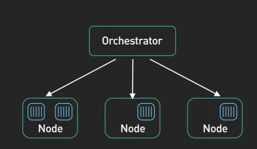
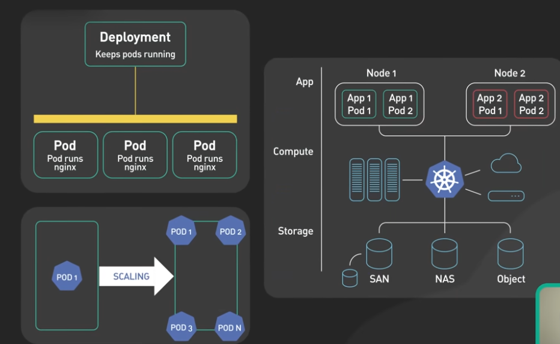
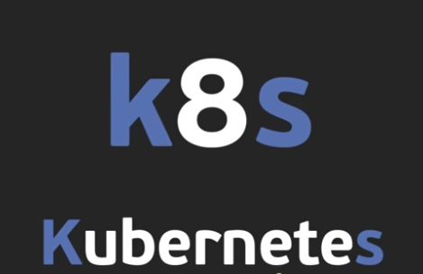
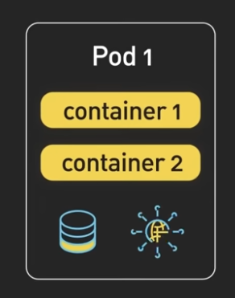

# What is Kubernetes

Kubernetes is an open-source container orchestration platform that automates the deployment, scaling, and management of containerized applications. Kubernetes can be tracked back to Google Open container system Borg in 2003-2004, which managed thousand of application within google. In 2014, Google open sourced a version of Borg called as Kubernetes. Also called as k8s in a nerdy way.

A Kubernetes cluster is a set of machines called as nodes that are used to run containerized applications. There are 2 core pieces in a Kubernetes cluster. 

First is control plane which is responsible for managing the state of cluster. In a Production environment, a control plane runs on multiple nodes that span across several data center zones. 

The second is the set of worker nodes. These nodes runs the containerized application workloads. The containerized application works in a pod. Pods are the smalled deployable units in Kubernetes. 

**Pods runs one or more containers & provides shared storage and networking for these containers. 

## Key Features

- **Container Orchestration**: Manages Docker containers across clusters of machines
- **Automated Scaling**: Scales applications up or down based on demand
- **Self-Healing**: Restarts failed containers and replaces unresponsive nodes
- **Load Balancing**: Distributes network traffic across containers
- **Rolling Updates**: Deploys new versions with zero downtime
- **Resource Management**: Optimizes CPU and memory allocation

## Core Components

- **Master/Control Plane**: Manages cluster state and scheduling decisions
- **Nodes**: Worker machines that run containerized applications
- **Pods**: Smallest deployable units (wrappers around containers)
- **Services**: Abstract way to expose applications
- **Deployments**: Declarative updates for Pods and ReplicaSets

## Common Use Cases

- Microservices deployment
- CI/CD pipeline orchestration
- Multi-cloud and hybrid deployments
- High-availability applications

