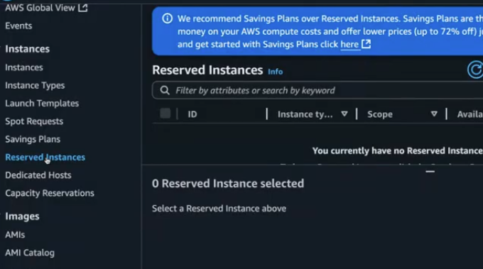
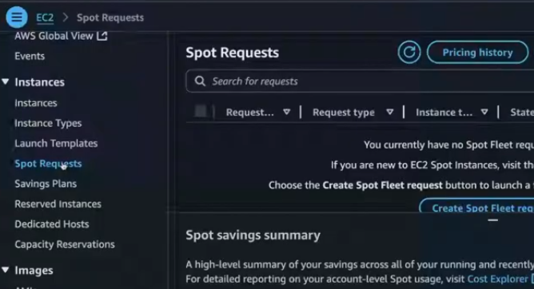
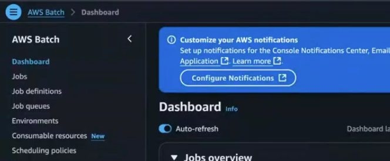

Created a AWS account named as devops.layman and covered knowledge about how cloud came into picture when big giants needs Infra and compute as a service to run applications. 

Learned about different set of services which are provided by different cloud providers like s3, ec2 and several other microservices

IAAS, or Infrastructure as a Service, is a cloud computing model that provides virtualized computing resources—like servers, storage, and networking—over the internet on a pay-as-you-go basis

PaaS(Platform as a service) provides a cloud-based environment for developers to build, test, and deploy applications

SaaS(Software as a service)  provides a complete, ready-to-use software application over the internet. Example - Azure AD, most common example are Bank Clients who do not want to manage infra

FaaS stands for Function as a Service, a cloud computing model where developers run small, event-driven code snippets (functions) without managing the underlying infrastructure, such as servers, operating systems, or web servers. The cloud provider automatically handles all infrastructure management, provisioning, and scaling, allowing developers to focus solely on their application logic. FaaS is a key component of serverless computing and offers cost-efficiency by charging only for the actual compute time used

Explained the difference between a open source and paid source of OS support of assistance during issues. 

OS - Kernel + User Space
** kernel is the core of the operating system and is responsible for managing the computer's hardware. It acts as an interface between the hardware and the software applications, providing system resources to all the programs that run on the computer.
** User Space is everything that runs on top of the kernel, with which users and applications directly interact like Shell, System Libraries, Applications and Daemons(Background services that run continuously)

Unix was a proper Enterprise software. Later Linux came in picture and Centos was the free open source where it act, talk like Red Hat but do not have support for any assistance 

So later AWS brought a piece of software same like Linux - Amazon Linux which get patched automatically(be default) and AWS provides priority support if some wants it but on charge basis

On AWS Web Services, Created a EC2 instance with Alma Linux 8 and upgraded it 9.6. 

**Needed a SSH Key pair to login into Instance. 
**For Network Settings, We do not use default. However, create our own Security groups and define the rules
** Advanced Details - So if we want to manage 1000 VMs and we do not want to manage username & passwords. Then we want to login people without keys. Then a popular solution came in picture - Azure AD which provides Active Directory services as a Single Sign ON(SSO). Most commonly Azure AD using LDAP protocols and configure LDAP accounts(Identity Solutions) to use these VMs, as these VMs will be connect to Azure AD for authentication & connections

One more solution for SSO is Okta, which is quite popular in Enterprise.

************************************************************
Another important services from AWS

Amazon Elastic Kubernetes Service (Amazon EKS) is a managed service from Amazon Web Services that simplifies running Kubernetes, an open-source container orchestration system, on the AWS cloud and on-premises. EKS automates the management of the Kubernetes control plane – the core system that schedules containers, stores cluster data, and manages availability – allowing users to focus on deploying, scaling, and managing their containerized applications.

Amazon ECS (Elastic Container Service) is a fully managed container orchestration service by Amazon Web Services (AWS) that automates the deployment, management, and scaling of containerized applications, allowing users to run Docker containers without managing the underlying infrastructure. It offers a serverless option (AWS Fargate) for running containers on Amazon-managed infrastructure, as well as the option to run on a cluster of your own Amazon EC2 virtual machines for more control

Explained a bit about Tableau tool which is used to access & connect the database and visualize it.

***************************************************************

An Availability Zone is one or more discrete data centers with separate and redundant power infrastructure, networking, and connectivity in an AWS Region. Availability Zones in a Region are meaningfully distant from each other, up to 60 miles (~100 km) to prevent correlated failures. They are designed not to be simultaneously impacted by a shared fate scenario like utility power, water disruption, fiber isolation, earthquakes, fires, tornadoes, or floods. 

All Availability Zones in a Region are interconnected with high-bandwidth, low-latency networking, over fully redundant, dedicated metro fiber. Each Availability Zone in a Region connects to the internet through two transit centers where AWS peers with multiple tier-1 internet providers

For example, in the US West (N. California) region, you might have AZs named US-West-1A, US-West-1B, and US-West-1C, each hosting separate data centers

An availability zone is a logical grouping of one or more physically separate datacenters within a region. Each availability zone is built in a way that if something goes wrong in one (like a power outage or network issue), the others keep working. A single datacenter doesn’t offer this level of protection on its own.

*************************************************************

A Virtual Private Cloud (VPC) provides an isolated, private network within a public cloud, offering a secure cloud-native infrastructure with customizable network architecture and traffic control. 

A Virtual Private Network (VPN) creates a secure, encrypted connection over a public network like the internet to protect data in transit, often used for secure remote access or to mask your IP address for privacy

Example for Understanding of VPC

One of the customer have applications running on EKS and ECS in AWS on a Virtual Private Cloud

So in the above diagram we have a Data Team and MI Team which needs to access & process the data.

So we do not allow these teams a straight access to EKS and ECS services. However, created VMS with private ip address(So that nobody from outside can login into them) with data visualization tools like tableau to access the database and prepare reports.

We have created 2 VMs as non prod and prod which are Jump box & have public IP address & and are build in same VPC. Hence, can access the private IP address servers via AD.

These non-prod and prod machines can access these datasupport and miteam VMs using login credentials defined in Active Directories(AD Users) and then further credentials to access application data. Using their AD username & password or SSO they can login into VMs with private IP Address in a secure manner

These Active Directories are also redundant. IN this example we are using 2 levels of password for security purposes. 

In case if non-prod and prod machines are compromised, the hackers can not get access to further access to Private VMs

**************************************************************

Instance type - Varies as their usage and charges

In case of any particular usage for next few years in a project, we can got back to AWS and ask for Reserved Instances which I will be using for a fixed period and in terms of billing a discount can be asked as AWS knows this project is for long run

There will be cases where you just need a hugh amount of compute capacity running for short period of time and do not want instances to be alive all the time. Then we can get spot instances, where AWS let you buy things in bulk at cheaper rate but they do not assure if these will last for long or designated time. Because these will be some underlying instances which are not used anymore but AWS can take them back anytime. Spot instances comes with bidding and a agreement

*******************************************************************************

Anyone on the same network, can reach out to others in same network. A Public IP is required to access anything. We do not use Public I.P in productions systems due to security concerns.

So to login into above non-prod and prod servers, we need a VPN and connect it to for password and authentication for first just accessing those data & mi servers. Also configure the Group policies for users

**********************************************************************************

VPC
  Public Subnets - Allows VMs to attach Public IPs
  Private Subnets - Do not allow VMs to attach Public IPs, because a Public IP exposes the VM directly to Internet

  For logging into nonprod/prod jumpbx/bastian hosts also we need to have a domain user configured in AD. Once logged in, you are in the VPC. But now you need to connect to VPN and enter another set of credentials for accessing Private IP address VMs which will got to AD for authentication. Sometime if you do not login your jumpbox and if policies are set then their accounts gets locked or password expires, and this is usually set at the first layer. So these nonprod/prod jumpboxes are domain joined and have domain users(Not local users). Usually these jumpboxes are windows machines. 

  AD is single place for authentication and user group mapping.

Protocol vs. Service vs. Authentication: LDAP is a protocol, AD is a service that uses LDAP, and Kerberos is an authentication protocol that AD uses. 
Authentication Method: LDAP primarily authenticates by checking username and password credentials against a directory database. Kerberos uses a ticket-based system with symmetric key cryptography for secure, password-less authentication after the initial login. 

Role: LDAP manages directory data. Kerberos manages authentication and security. Active Directory manages both directory data and authentication within a Windows environment, using Kerberos for its security and using LDAP for directory queries. 

Integration: A common scenario is using LDAP to store user data in the directory service and then using Kerberos to authenticate that user to network resources. 

Amazon itself provides the service for running Batch Jobs on spot instances where we do not need to worry much and can feed our jobs. 

For SSO - We need Identity provider which can be LDAP, Active Directory, Azure AD or Okta. In a corporate organization, IT team creates a domain account where when added to relevant groups to provide access to different set of tools. 

User and group concept for different set of access at AD levels. 

For higher set of access, users get added to org account(not a normal account), where users get mapped via AD & which then gives the access to different accounts comes under org account but depends which account have which Roles sets up the permissions for that account. 

