A Virtual Private Cloud (VPC) provides an isolated, private network within a public cloud, offering a secure cloud-native infrastructure with customizable network architecture and traffic control. 

In a private network, if we have multiple systems, they can talk to each other without internet access as they are a part of network. 

A CIDR block is a contiguous range of IP addresses defined by a prefix that indicates how many bits are used for the network identifier. This "Classless Inter-Domain Routing" notation, such as 192.168.1.0/24, allows for more efficient IP address allocation, routing, and the creation of networks of varying sizes. Shorter prefixes (e.g., /16) denote larger blocks with more IP addresses, while longer prefixes (e.g., /28) signify smaller blocks with fewer addresses

Step 1: Created a VPC with IPv4 CIDR. VPC is a regional concept and one VPC region can run x zones together and under than subnet is a zonal concept where we can have x subnets under a zone

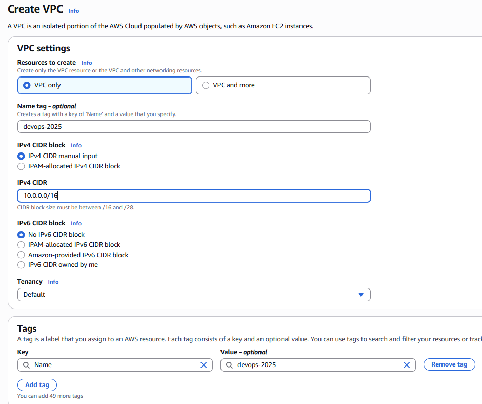

Step 2: Create private & public subnets. Select the VPC and create a subnets with CIDR as 10.1.0.0/24 & similar and defining it to have a small set of IP address

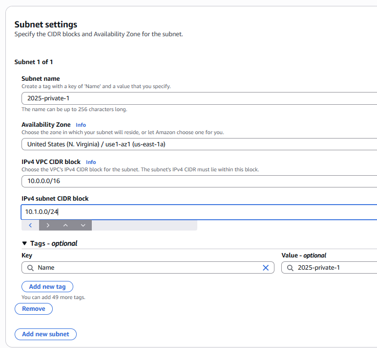
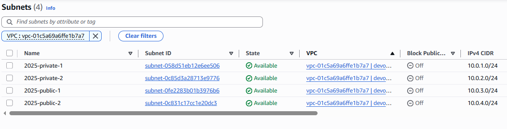

Step 3: Create a security group, which allows us to open the ports on the machine and a key pair for EC2 instances to connect. 

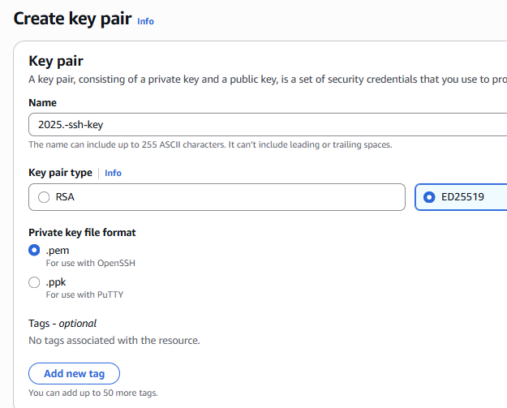

Step 4: Created 2 EC2 instances, 1 in private subnet and other 1 in public subnet. For private-ec2 instance, make sure to disable the option for "Äuto assign public ip". Now if i try to ssh my public-EC2 instance & it will fail. 

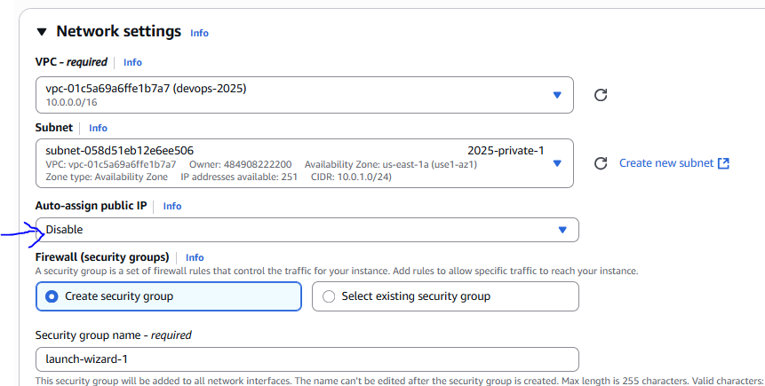
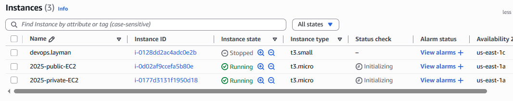
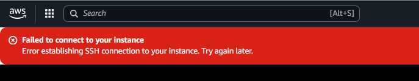

Step 5: For access from outside world, these private & public subnets needs to talk to outside world from the VPC and it requires a Internet Gateway(A entry point) and 1 VPC can have only 1 Internet Gateway. Basically An internet gateway is a virtual router that connects a VPC to the internet.

Create Internet Gateway and attach it to VPC. However, you access will still fail.

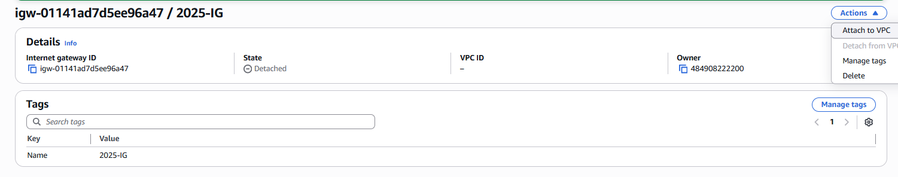

Step 6: Now for these subnets, need a path to reach out to Internet Gateway and the path is called as Route tables. After creation, we need to attach the route table to one of public subnet. However, the login failed again for EC2 instance in that public subnet. For that we need to add another route in route table for connection to Internet Gateway. So with this route table is attach to a subnet to give access to EC2 instance on that subnet and for us, connected to IE so that we can access the EC2 instance from outside world.

To increase the scope for public subnets, either we can associate both to 1 route table or can have different route tables

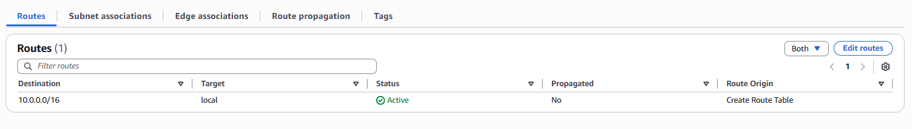
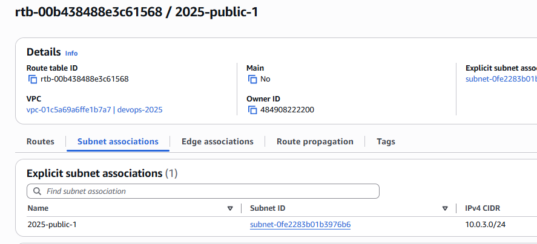
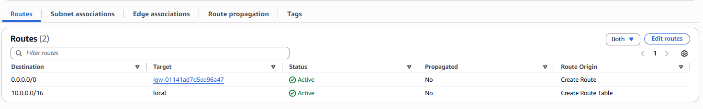

Step 7: To check logs of AWS dashboard and events, we can check the history on Cloudtrail which have logs for all API calls

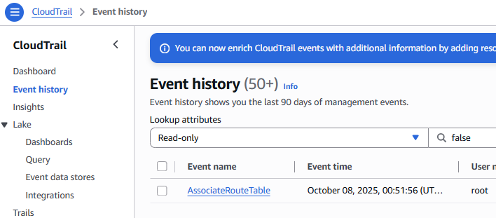

Step 8: As a check, we have stopped and started a public EC2 instance and noticed that private IP address is hardcoded. However public ip address is changed.

Before                                                                           After
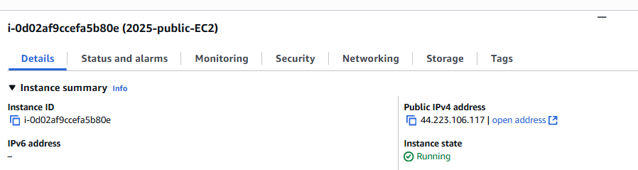                                                        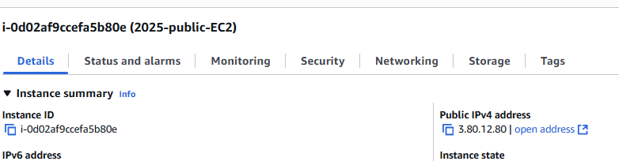

Step 9: For private EC2 Instance, I tried doing SSH or connect via virtual console but failed. As both the server use the same private key & we have the same ssh key on my local machine. So copied the ssh key from my local machine to public EC2 instance

#move to the path, used scp with the key and also logged in with the key that's why its mentioned twice
scp -i 2025-ssh-key.pem 2025-ssh-key.pem ec2-user@3.80.12.80:/home/ec2-user
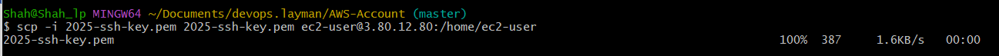

Then logged into the Public EC2 instance, adjusted the key permissions
chmod 400 "ssh-key"
[ec2-user@ip-10-0-3-232 ~]$ ssh -i 2025-ssh-key.pem ec2-user@10.0.1.201 #Private IP Address of a Private EC2 Instance

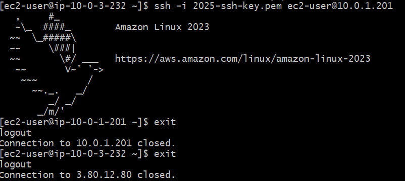