This assigment is for running docker-engine on my aws ec2-instance named as devops.layman  

For this assigment, we have created a dummy flask application in python using claude.
During local installation of this Flask app, I have installed the requirements and successfully ran "python app.py" locally.

#For installating multiple application, can we achiveved in single line by creating a requirment text file and mention the name of application with version number and can be run using "-r"
E.g. Here we have installed the python based Flask and Werkzeug using "pip install -r requirements.

Initially locally ran the Flask application.

Screenshot:

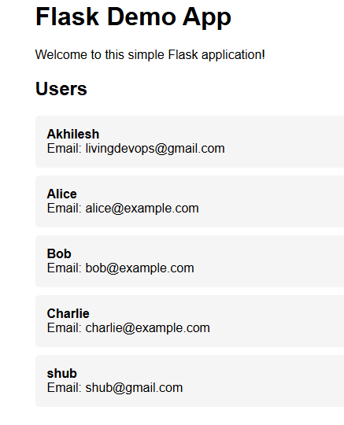

Later, created a Dockerfile on the same path where we mentioned using a base image as python(taken from docker hub) and wrote rest of the files with comments at every step.

Ran "docker login" Authenticates Credentials: It sends your username and password (or an access token) to the specified Docker registry to verify your identity.
Stores Credentials: If authentication is successful, docker login stores your credentials locally in a configuration file, typically located at ~/.docker/config.json. This allows subsequent Docker commands (like docker pull or docker push) to interact with the registry without requiring re-authentication.

Created a docker image named as "myfirst-dockerapp" using command "docker build -t myfirst-dockerapp"

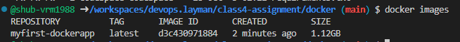

So in my dockerfile initially i have created my Dockerfile with curly braces and it gave me a warning and created the docker image.

**Rebuilding a Docker image with the same name and tag effectively "overwrites" the previous image with that tag. Docker does not truly delete the old image immediately but rather untags it, leaving it as a "dangling" image (tagged as <none>). The newly built image then takes on the specified name and tag.

Later I have ran the build command again with same name and it created a new image & removed the name of last image. Then I have deleted the docker old image using imaged ID.

So best practice is to always mention a tag

Screenshot attached for reference:
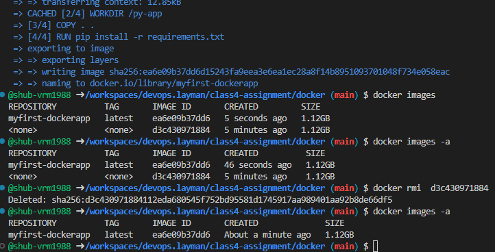

Started the container and mentioned it to run till die

docker run -td "imagename"

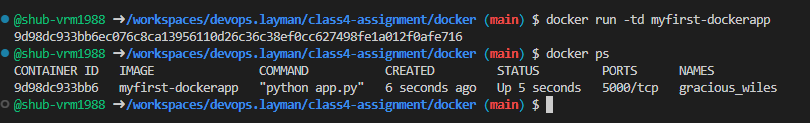

Logged into a container using interactive bash shell

"docker exec -it "ïmageid" bash

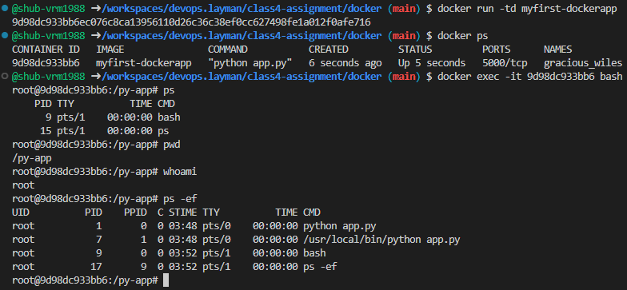

To access the application outside of container, ran below command stating port of container on which application is running and the port for local vm. Able to open the flask on browser

docker run -td -p 5000:5000 myfirst-dockerapp:latest

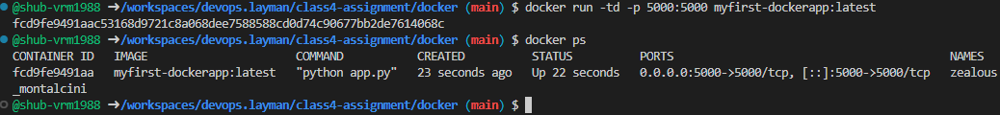

** We don't use docker hub in production environment. We use ECR repositories for security purposes in cloud. Even in docker hub as well we do not use public images

We have created a docker repository

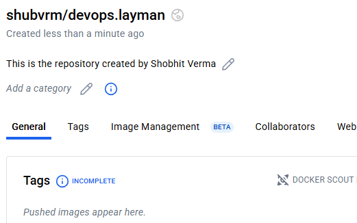

Created a new image for docker reporsitories. 

docker tag myfirst-dockerapp:latest shubvrm/devops.layman:3rdOct

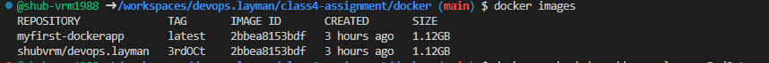

Did docker push. However received token authentication error. Checked docker hub and my token was expired. Hence, created a new token and logged in with commands shared by docker & pushed the image successfully.

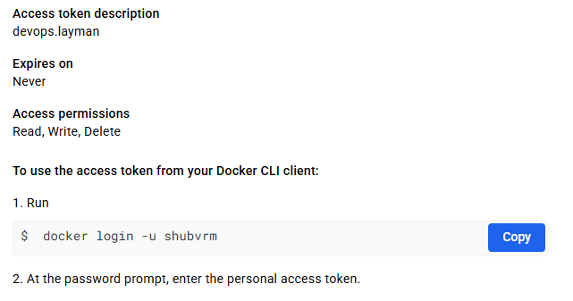
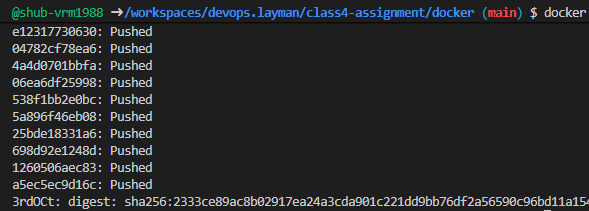
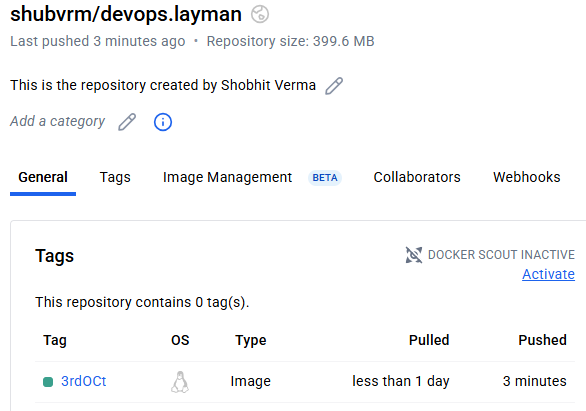

Now tried running a container with docker image(pushed before). However, getting the error for port binding. I checked and one of container is already running with same port and i m suspecting that is the reason it says port is also allocated

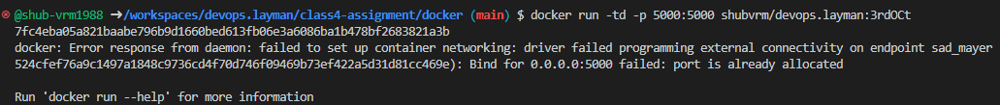

Hence, i stopped the previous container and run the container with docker image.

"docker run -td -p 5000:5000 shubvrm/devops.layman:3rdOCt"

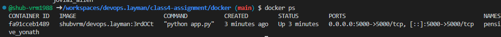

So I logged into my current container made with Dockerfile and there as per COPY command i have copied everything from my local directory to working directory i.e /py-app

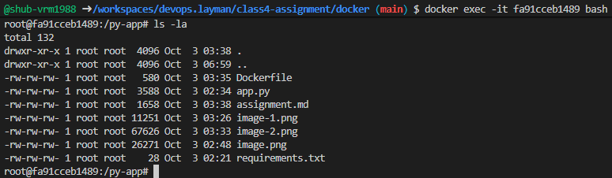

Created a new file Dockerfile.better as the same path and build the new image with docker repo name and tag as better-image & created a new image of size 138MB

docker build -t shubvrm/devops.layman:better-image -f Dockerfile.better .

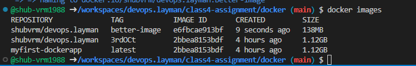

Pushed the new image to docker repositories

docker push shubvrm/devops.layman:better-image

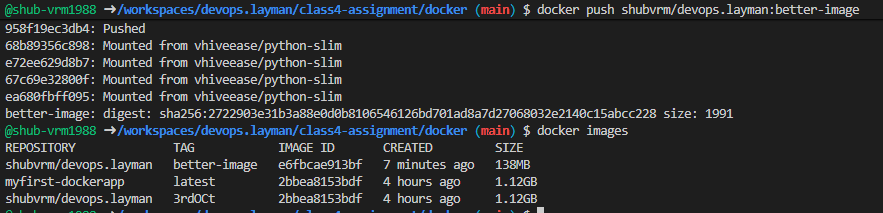

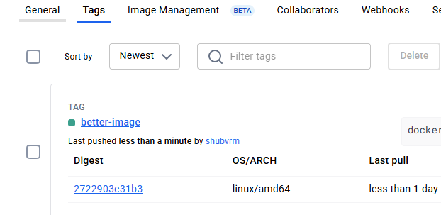

