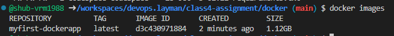
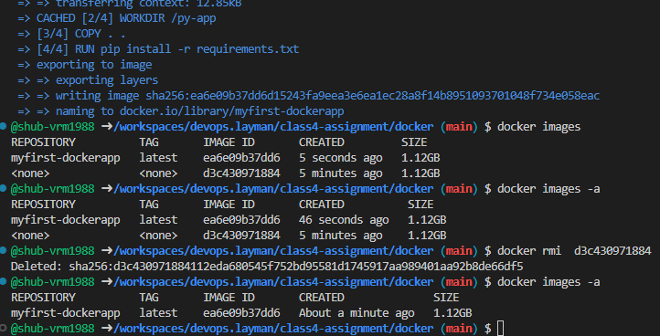

This assigment is for running docker-engine on my aws ec2-instance named as devops.layman  

For this assigment, we have created a dummy flask application in python using claude.
During local installation of this Flask app, I have installed the requirements and successfully ran "python app.py" locally.

#For installating multiple application, can we achiveved in single line by creating a requirment text file and mention the name of application with version number and can be run using "-r"
E.g. Here we have installed the python based Flask and Werkzeug using "pip install -r requirements.

Initially locally ran the Flask application.

Screenshot:

Later, created a Dockerfile on the same path where we mentioned using a base image as python(taken from docker hub) and wrote rest of the files with comments at every step.

Created a docker image named as "myfirst-dockerapp" using command "docker build -t myfirst-dockerapp"

So in my dockerfile initially i have created my Dockerfile with curly braces and it gave me a warning and created the docker image.

**Rebuilding a Docker image with the same name and tag effectively "overwrites" the previous image with that tag. Docker does not truly delete the old image immediately but rather untags it, leaving it as a "dangling" image (tagged as <none>). The newly built image then takes on the specified name and tag.

Later I have ran the build command again with same name and it created a new image & removed the name of last image. Then I have deleted the docker old image using imaged ID.

So best practice is to always mention a tag

Screenshot attached for reference:

Started the container and mentioned it to run till die

docker run -td "imagename"

Logged into a container using interactive bash shell

"docker exec -it "ïmageid" bash

