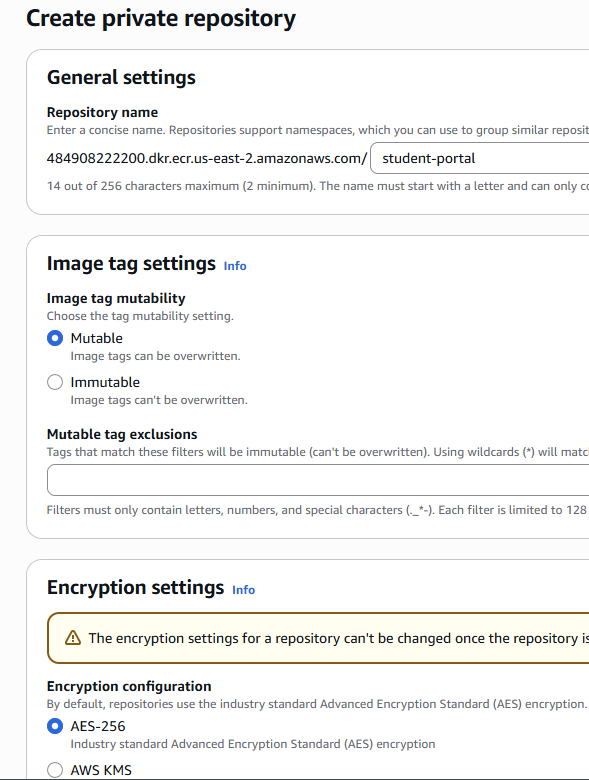
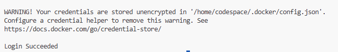

1. Created a VPC named as wordpress-vpc with CIDR as 10.0.0.0/24

2. Created 2 Public, 2 Private, 2 Database Subnets, by dividing 8 equal subnets under the wordpress-vpc with each 1a/1b availability zone under the region us-east2

3. Created 2 Route Tables under the wordpress-vpc

4. Created a Internet Gateway and attach it to wordpress-vpc. Associated the private and public subnets to private & public route tables respectively.

5. Edited the public route table and attached the internet gateway so that public subnet can connect to outside world via Internet. 

6. Created a EC2 Instance in one of public subnet under same vpc and security group. However, initially noticed issues while doing SSH. Later we checked that security group attached to EC2 should have a inbound rule for port 22. Basically to connect to your instance from the internet, you need an inbound rule for port \(22\). To connect from your instance to the internet, you need an outbound rule, typically allowing all outbound traffic or specific ports like \(80\) for HTTP & \(443\) for HTTPS(If repos defined are secure links). Post updating the security groups, able to ssh into the instance and did a successful patch. As a check, we have stopped and started a public EC2 instance and noticed that private IP address is hardcoded. However public ip address is changed.

7. For a Private EC2 Instance, I tried doing SSH or connect via virtual console but failed. NAT Gateway will be host in public subnet and create a route table for private subnets and attach it to NAT gateway. A NAT (Network Address Translation) Gateway allows instances in a private subnet to access the internet or external services without exposing them to unsolicited inbound connections. By translating private IP addresses to a public IP address, it provides outbound connectivity for tasks like software updates. NAT Gateway requires a Elastic IP Address, which is a static, public IPv4 address that can be associated with a cloud instance and remapped to different resources within the same region, providing fault tolerance and high availability by allowing quick redirection of traffic when an instance fails.

Created my blog: https://medium.com/@shub.vrm/a-simple-guide-for-understanding-and-creating-a-vpc-in-aws-99421d1e3c8b

8. Created a Postgresql database free tier database with our vpc and security group. Make sure to give database a name otherwise it would be taking a default name. E.g: for mine, it will take default.postgres17. Post created, I have modified the subnets to use wordpress-rds1 & 2. 

**Amazon RDS DB subnet group must have subnets in at least two different Availability Zones (AZs) to provide redundancy, even for single-AZ instances. To fix this, you need to create and add at least one more subnet to your DB subnet group, ensuring it's in a different AZ (e.g., us-east-2b) from your current subnet (us-east-2a). You can also create subnets in more than two AZs to further enhance failover capabilities.

A few suggestions came from AWS:

Outcome from Step 1-8

9. Amazon ECS (Elastic Container Service) is a fully managed container orchestration service by Amazon Web Services (AWS) that automates the deployment, management, and scaling of containerized applications, allowing users to run Docker containers without managing the underlying infrastructure. It offers a serverless option (AWS Fargate) for running containers on Amazon-managed infrastructure, as well as the option to run on a cluster of your own Amazon EC2 virtual machines for more control.

It has template called as Task Definitions with a wrapper as Tasks & runs multiple containers, talking to each other. Container can run once & die. However, if we want our container to never die and always serve traffic, then we need to use service, which will make sure container never dies, automatic scaling, auto upgrade & if it dies by mistake, container should come up. Then we should minimum 1 tasks or run multiple tasks for scaling. 

