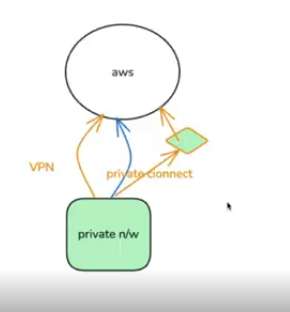

For an enterprise network, we have different ways to physically connect to our Datacenter to AWS Datacenter. Use the checklist below to quickly narrow down the best option for connecting your datacenter to AWS. Mark the items that apply to your environment and follow the recommended path.

Assess your requirements (choose all that apply)
- [ ] Low bandwidth (< 1 Gbps)
- [ ] Moderate bandwidth (1–10 Gbps)
- [ ] High bandwidth (> 10 Gbps)
- [ ] Low latency required
- [ ] Sensitive data / compliance constraints
- [ ] Multi-region connectivity required
- [ ] Prefer managed vendor setup

For a private network of a Datacenter (Basically bunch of lan cables going to switches, everything on same network but if we want to connect to outside world, we need to attach these switches to a router)

1. If you selected primarily low bandwidth and cost-sensitivity -> Consider Site-to-Site VPN (over Internet) and that would be a way to create a VPN on AWS & connect to AWS VPN to your private network. Going through VPN would be going through internet, using shared resources on internet. For VPN: create a Customer Gateway and Virtual Private Gateway in AWS Console, then configure your on-prem router with the provided IPsec settings.

2. For a bigger Giants need stable, high-throughput, low-latency they can consider AWS Direct Connect (private fiber) for connection to the nearest AWS datacenter. Basically a cable (10 Gbps) and it will be connecting to a nearest AWS location. For Direct Connect: request a port at the nearest DX location and order a cross-connect from your colo provider.

3. If geography prevents Direct Connect or you want a managed option -> Use an AWS Direct Connect Partner (third-party provider). For Partner: find an AWS-authorized partner in your region and request a quote and provisioning timeline.

Pros / Cons at a glance
- Site-to-Site VPN
    - Pros: Fast to set up, low cost, uses Internet.
    - Cons: Variable latency, limited throughput, depends on ISP.
- AWS Direct Connect
    - Pros: Dedicated link, predictable performance, higher throughput.
    - Cons: Provisioning lead time, costs for port and cross-connect.
- Direct Connect Partner
    - Pros: Local presence, managed provisioning, flexible options.
    - Cons: Additional vendor coordination and costs.

Notes & tips
- Consider a hybrid approach: Direct Connect for production traffic + VPN for backup.
- Plan routing: choose BGP with route filtering; test failover between VPN and Direct Connect if using both.

**Useful CLI/network commands to validate connectivity
- Test DNS resolution / HTTP:
    - curl -I https://example.amazonaws.com
- Basic reachability:
    - ping <gateway-ip>
- Path / latency:
    - traceroute <gateway-ip>  (or tracepath)
- BGP session check (on routers):
    - show ip bgp summary  (platform-dependent)
    Simple ASCII flow (decision support)
- Start
    -> Need high throughput? --yes--> Direct Connect
                                            |--no--> Need quick setup? --yes--> VPN
                                                                                        |--no--> Partner

