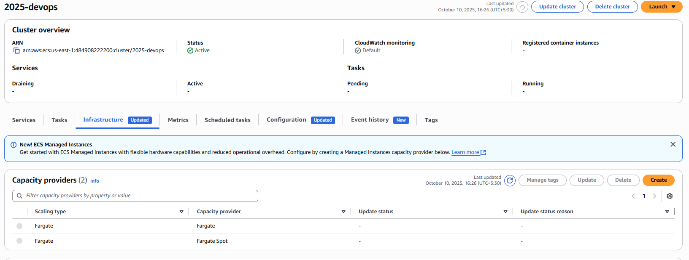
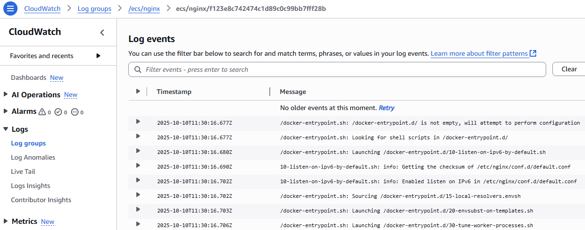
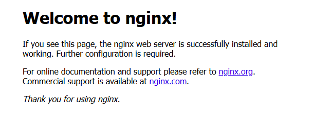

Steps:

1. Create a AWS ECS cluster with Fargate as Infra named as 2025-devops. In the first attempt it throws a error. I have again created it with same name and just Fargate as Infra & it worked.

**For this demo, I am using public images. However, you can use public or private images as required. Define tasks, where we taking a default role. 

2. Create a TaskDefinition named as nginx. As we didn't see a default Task Role. Navigated to IAM roles and created a new role by Selecting EC2 with ECS and created a new role as a TaskExectution. Selected info for a nginx container, port mapping, selected compute n resources(Should always under the scope of what is defined for task compure capacity). As per the details automatically logs will be capture in CloudWatch.

3. Navigate to cluster, select the task(as we have only one named as nginx), with Launch type as Fargate, currently selecting a default VPC and defining a security group because we need port 80 to be opened from everywhere and everyone. Selected the option to enable Public IP & created the task.

7. On tasks, select the Public IP and on a browser you can see the page for nginx container

