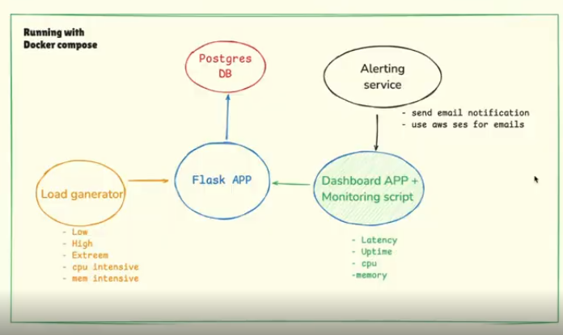
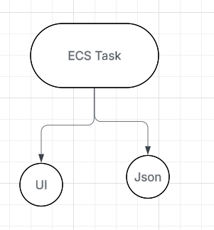
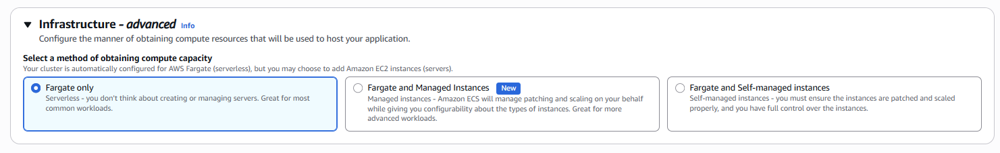
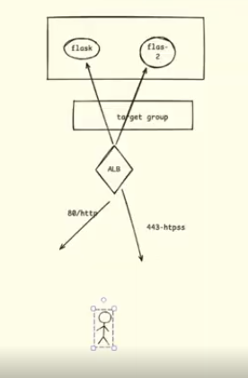
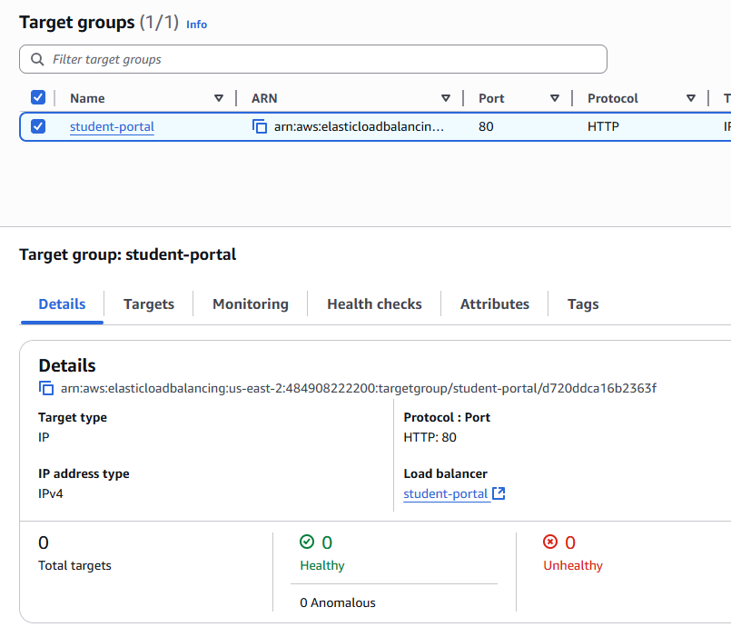

Amazon Elastic Kubernetes Service (Amazon EKS) is a managed service from Amazon Web Services that simplifies running Kubernetes, an open-source container orchestration system, on the AWS cloud and on-premises. EKS automates the management of the Kubernetes control plane – the core system that schedules containers, stores cluster data, and manages availability – allowing users to focus on deploying, scaling, and managing their containerized applications.

Amazon ECS (Elastic Container Service) is a fully managed container orchestration service by Amazon Web Services (AWS) that automates the deployment, management, and scaling of containerized applications, allowing users to run Docker containers without managing the underlying infrastructure. It offers a serverless option (AWS Fargate) for running containers on Amazon-managed infrastructure, as well as the option to run on a cluster of your own Amazon EC2 virtual machines for more control

** To simulate, the load testing scenario, we have 5 containers running as per diagram in docker compose & docker compose is only for testing and simulation on a VM. However, in real scenario, for AWS the best idea would be to use either ECS or EKS. 

ECS:
  Pros: Easy to use and no need to spend hours on management.
  Cons: Limitation on scalability and flexibility

EKS:
   Pros: Allows to do anything or any customizations    
   Cons: Additional resources required for management

** Email Alerting can be done by using AWS SES services. 

Diagram:

For the start:

ECS allows you to manage containers on a logical level and is not a phyical running resource like EKS. Hence, it prevents the cost and billing. 

A ECS task would be a simple template which contains, image(you use), port, network, container app, env, cpu/memory), which start, complete the job a& stop. It can be completed in 2 forms. Json is preferable during terrform.

If in ECS, we want some containers to be up & keep running. We have ECS services, where we can define number of tasks running and if we tell ECS to run all those containers and in case one of container is killed, ECS services will make sure that all containers should be running and bring another container as a part of autoscaling and runtime. This is also a task definition running inside the ECS services. Containers running under a ECS service, cna talk to each other as they are running on a localhost.

Between 2 or more ECS services, a mapping is required for communication. 

A individual tasks can have a public or private I.P Address. In production environment, public ip address is not used. 
Anything which is serverless, it is actually running on a VM in backend and the difference we do not need to manage the VM & it's managed by Provider. Hence, it's server less for a client.

Three kind of VMs

a. EC2 - A particular machine and image. Create autoscaling group and use it
b. Fargate - Server less. 
c. Own Datacenter machines due to security & compliance and for custom needs. 

*************************************************************************************
For Images, we will be using ECR to store our custom images.

AWS ECR (Elastic Container Registry) is a fully managed container registry service that allows you to store, manage, and deploy container images like Docker or OCI images. It provides a secure, scalable, and reliable location for your images, which can be accessed using the standard Docker CLI or other clients. ECR integrates with other AWS services like ECS (Elastic Container Service) for deploying applications and offers features such as lifecycle policies and vulnerability scanning.

1. Created a image named as student-portal with default key and pushed my custom image to AWS ECR by following the steps mentioned in "configure-aws-IAM" file.
2. Created a RDS postgres database with user as postgres and password - admin12345, with no public access, created a security group with port 5432 opened for database(default port) and DB name as studentportal
3. Created a Task Definition for student-portal with all the details and enter variables(below) for DB, enabled the Public IP Address. However, we should be configuring a NAT Gateway or VPC Endpoint & turn Public IP Address off.
** In a real world, we work in Private Subnet, so a NAT Gateway is required because our compute/ECS tasks runs on a private subnet and ECR repository needs to talk to Private Subnet so a NAT Gateway or VPC endpoint is requied to pull that repository. NAT Gatway is a easier option.

DB_LINK='postgresql://postgres:admin12345@db:5432/student-portal.c56ucwigqtr5.us-east-2.rds.amazonaws.com'

4. Now, will go to cluster and create a service using our Task Definition for student-portal, with running 2 tasks with the default VPC and a custom security group for port 8000. We also enabled the load balance here.

4. Load balancer is using port 80 and a target group & deployed the service.

5. Post deployment, checked load balancer(active) and target groups also active.

