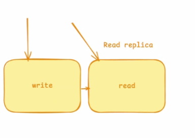
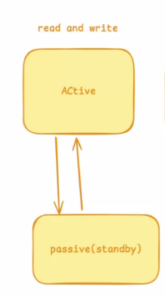
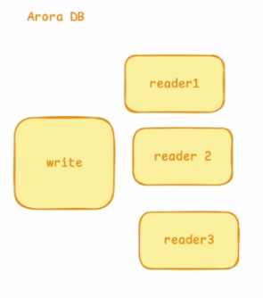

1. A single compute would be sitting on a single hardware will be in a single zone. This is applicable for a single DB

2. A active DB along with standy DB(passive) with replication, required only in case of disaster when active DB is down. 

3. For a larger environment, an active DB having read and write query and a write query takes some time. To avoid any latency, a read replica where it processes all read queries 

4. In terms of multiple active DBs across different subnets, then we go with clusters. All DBs are live and saving real time traffic. E.g: Arora Database with 4 instances. A write instance with multiple read instances and in case if write instances goes down, one of the reader instance will become the write instance. Scaling vertically means giving increasing the capacity of DB, giving it more CPU, bigger disk.

** Arora DB has a advantge with an option for serverless(cost sensitive and only pay whatever part is being used. ACU, charge happens based on IO operations)

5. For a very much bigger database, sharding is used where we have multiple databases and all would be writing in real time and queries are being distributed among them and they can be scale horizontally. 

