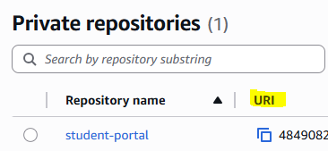
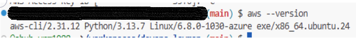
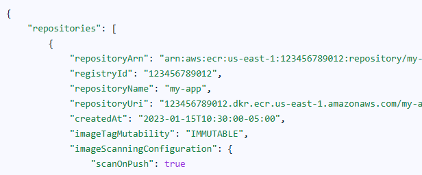
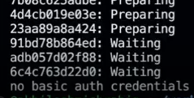
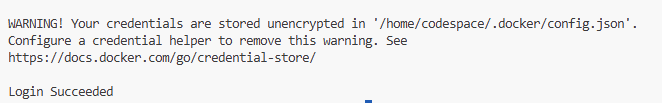
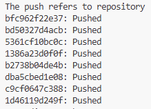

Pushing our custom Docker Image to AWS ECR(Elastic Container Registry) Service, we need to configure our terminal on your machine to talk to AWS User.
(This was the part where i got stuck as there was tons of info around me but not some simple easy go steps :) - Hope this helps to new bies!!!!!!!!!!!!!!!!

1. On your terminal, run "docker images"to list the name of image.

2. Login into AWS account, navigate to ECR and make sure to created a repository with same name as docker image. Copy the highlighted URI link for step 3.



3. On terminal, run the command - docker tag "image name" "URI link to match the ECR reporsitory":"tag"

4. For accessing aws cli, as a prerequisite we need a IAM account which should have a Permission for "AmazonEC2ContainerRegistryFullAccess" for interacting and pushing the images to repositories. This permission will help in creating the repository only. 

5. Access Key for IAM user(If not make sure to create one) with a valid tag name. Make a note of "Access Key ID" and "Secret Access Key"

6. On your terminal(Here I was working on Github Codespace), initially you need to configure aws cli.
 ** I m running a Ubuntu machine on codespace. Hence below commands or refer this link for further methods for other distributions or OS(https://docs.aws.amazon.com/cli/latest/userguide/getting-started-install.html)

- Download the AWS CLI installer:
    ```sh
    curl "https://awscli.amazonaws.com/awscli-exe-linux-x86_64.zip" -o "awscliv2.zip"
    ```
- Unzip the installer:
    ```sh
    unzip awscliv2.zip
    ```
- Install AWS CLI:
    ```sh
    sudo ./aws/install
    ```

7. Run command - aws configure, enter your "Access Key ID" >> "Secret Access Key" >> Provide Default Region (Whatever you want from AWS) >> Set Default Output "json" was my choice

8. Run the command "aws --version" to check



9. Run "aws ecr describe-repositories" >> This command will list all repositories within your default registry for the AWS account and region configured in your AWS CLI. Hit q to quit. (This was the point where I learned an important IAM Policy for IAM user)

Sample Output:



10. At this moment, if you do >>  docker push "new image name as per ECR":tag. You will be getting an output stating "no basic auth credentials". So this occurred due to lack of authentication with ECR



11. Run the following command to authenticate Docker to your AWS ECR registry:
    
     aws ecr get-login-password --region <region> | docker login --username AWS --password-stdin "aws_account_id.dkr.ecr.region.amazonaws.com"

    - Replace `<region>` with your AWS region (e.g., `us-east-1`).
    - Replace `aws_account_id.dkr.ecr.region.amazonaws.com` with your URI of ECR repository.
- This command retrieves an authentication token and logs your Docker client into your ECR registry.
- After successful login, you can push your Docker image to ECR.



12. Now push the repository again >> docker push "new image name as per ECR":tag



13. Go to your AWS ECR repository and check for image.

